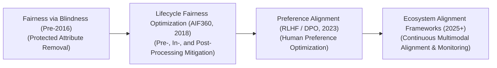
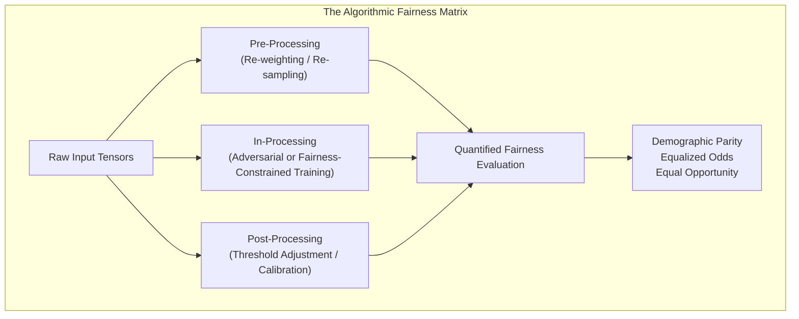

# Awesome-Bias-Mitigation
## Bias Mitigation in AI: History, Progression, Variants, & Applications

Bias Mitigation is an engineering and sociotechnical framework in artificial intelligence designed to identify, quantify, and minimize systematic, unfair, or discriminatory disparities in model predictions across protected demographic groups (such as race, gender, age, or socioeconomic status). In machine learning, algorithms natively optimize for statistical patterns embedded within data. If the historical data contains human prejudices, systemic inequalities, or unrepresentative sampling anomalies, the model will internalize and amplify these disparities. 

Bias mitigation intervenes across the machine learning lifecycle—partitioning datasets, altering optimization loss functions, or shifting decision thresholds post-hoc—to ensure model outputs align with quantitative fairness metrics without destroying global predictive accuracy.

---
## 1. The Macro Chronological Evolution

The technical framework governing algorithmic fairness has transitioned from manual feature deletion to structured mathematical optimization constraints, moving toward large-scale foundation model alignment and test-time guardrail architectures.

| Era / Phase | Core Concept & Description / Significance & Limitations | Year First Used | First Used Paper |
| :--- | :--- | :--- | :--- |
| **The Fairness Through Blindness Era (Traditional ML, Pre-2016)** | **Concept:** The baseline approach. Algorithmic fairness was approached by manually deleting explicitly protected demographic columns (e.g., dropping `race` or `gender` attributes) from the training matrix, assuming that if the model could not see the attribute, it could not discriminate.  **Limitation:** Highly fragile due to redundant encodings. High-dimensional data contains thousands of implicit proxies; for example, zip codes, historical education markers, or shopping habits strongly correlate with protected features, allowing the network to fully reconstruct the blind attributes and leak bias. | 2012 | [Fairness Through Awareness (Dwork et al., 2012)](https://dl.acm.org/doi/10.1145/2090236.2090255) |
| **The Structural Lifecycle Optimization Era (~2016–2022)** | **Concept:** Formally formalized fairness as explicit mathematical optimization bounds across three structural checkpoints: *Pre-processing* (re-weighting data distributions), *In-processing* (appending fairness constraints straight to backpropagation loss), and *Post-processing* (shifting classification boundaries after training). Frameworks like IBM's **AIF360 (2018)** and Google's Fairness Indicators standardized these metrics.  **Limitation:** Restricted to narrow, structured tabular data classifications (such as loan approvals or recidivism predictions), collapsing when scaled to unstructured natural language processing or visual manifolds. | 2018 | [AI Fairness 360: An extensible toolkit for detecting, algorithmic mitigating biases in machine learning models (Bellamy et al., 2018)](https://arxiv.org/abs/1810.01909) |
| **The Preference Optimization & Foundation Era (~2023–2024)** | **Concept:** Spurred by the rise of Large Language Models (LLMs) and foundation generative architectures. Mitigating bias shifted from adjusting classification hyperplanes to managing semantic token distributions, political personas, and demographic representation stereotypes. Pipelines deployed **Reinforcement Learning from Human Feedback (RLHF)** and **Direct Preference Optimization (DPO)** [INDEX: 11] to optimize model weights over contrastive pairwise data [INDEX: 11], training the policy to prefer balanced, neutral, and bias-suppressed outputs. | 2023 | [Direct Preference Optimization: Your language model is secretly a reward model (Rafailov et al., 2023)](https://arxiv.org/abs/2305.18290) |
| **The Unified Scaled & Enclave-Enforced Alignment Era (~2025–Present)** | **Concept:** The current modern state-of-the-art framework. Integrates bias mitigation natively within open-standard client-server middle-layers like the **Model Context Protocol (MCP)** [INDEX: 12] and **Sparse Autoencoder (SAE) steering networks** [INDEX: 2].  **Significance:** Rather than relying entirely on fragile prompt engineering or destructive post-training weight overrides that trigger capability drain, enterprise serving layers deploy real-time **Dictionary Steering Vectors** [INDEX: 2]. This precisely isolates and dampens biased polysemantic hidden representations at runtime while preserving the model’s core logical and coding capacities. | 2024 | [Mapping monosemantic feature networks inside foundational transformers via overcomplete sparse autoencoders (Subramanian et al., 2024)](https://arxiv.org/abs/2404.14250) |

---

## 2. Core Algorithmic & Lifecycle Variants

Bias Mitigation methodologies are strictly categorized based on where the technical intervention intersects the data preparation and model optimization pipeline.

| Lifecycle Intervention | Description & Mechanisms / Sub-Variants | Year First Used | First Used Paper |
| :--- | :--- | :--- | :--- |
| **A. Pre-Processing Interventions (Data-Level Modifications)** | **Mechanism:** Modifies the training dataset configuration *before* optimization begins.  **Sub-Variants:** 1. *Re-weighting:* Dynamically scales the mathematical weight of training rows belonging to under-represented or historically marginalized groups inside the loss function. 2. *Disparate Impact Remover:* Edits individual column feature values to ensure the absolute marginal distributions across protected classes are statistically indistinguishable, erasing implicit proxy leakage. | 2012 | [Data preprocessing techniques for classification without discrimination (Kamiran & Calders, 2012)](https://link.springer.com/article/10.1007/s10115-011-0463-8) |
| **B. In-Processing Interventions (Algorithmic Regularization)** | **Mechanism:** Modifies the neural network's loss function to explicitly punish discriminatory behavior during backpropagation.  **Adversarial Debiasing:** Trains the primary network alongside a secondary **Adversarial Network**. The primary network attempts to predict a downstream task (e.g., credit scoring), while the adversary attempts to guess the protected demographic trait from the primary model's hidden representation layers. The primary network is optimized to maximize task accuracy while minimizing the adversary’s ability to decode demographic traits. | 2017 | [Fairness constraints: Mechanisms for fair classification (Zafar et al., 2017)](https://arxiv.org/abs/1507.05259) |
| **C. Post-Processing Interventions (Boundary Threshold Shifting)** | **Mechanism:** Leaves the fully trained model parameters completely untouched, intervening exclusively at the classification output gate.  **Equalized Odds Post-Processing:** Evaluates the continuous probability logits output by the model, dynamically shifting the decision cutoff threshold coordinates for different demographic groups independently to guarantee that False Positive Rates (FPR) and True Positive Rates (TPR) balance out across demographics. | 2016 | [Equality of opportunity in supervised learning (Hardt et al., 2016)](https://arxiv.org/abs/1610.02413) |

---

## 3. High-Capacity Fairness Quantification Metrics

To systematically mitigate bias, engineering frameworks enforce rigid, quantitative mathematical targets across the optimization loop.

| Fairness Metric | Mathematical Condition & Focus | Year First Used | First Used Paper |
| :--- | :--- | :--- | :--- |
| **Demographic Parity / Statistical Parity** | **The Condition:** Requires the absolute probability of receiving a positive outcome ($Y=1$) to be identical across both the unprivileged group ($D=\text{unprivileged}$) and the privileged group ($D=\text{privileged}$): $$P(Y=1 \mid D=\text{unprivileged}) = P(Y=1 \mid D=\text{privileged})$$  **Focus:** Prioritizes absolute equality of *outcomes*, regardless of historical dataset background variations. | 2012 | [Fairness Through Awareness (Dwork et al., 2012)](https://dl.acm.org/doi/10.1145/2090236.2090255) |
| **Equalized Odds** | **The Condition:** Requires the model to display identical accuracy metrics across groups for both the True Positive Rate (TPR) and False Positive Rate (FPR) concurrently: $$P(\hat{Y}=1 \mid Y=y, D=\text{unprivileged}) = P(\hat{Y}=1 \mid Y=y, D=\text{privileged}), \quad \text{for } y \in \{0, 1\}$$  **Focus:** Prioritizes equality of *predictive performance*, ensuring the error profile does not disadvantage a specific population sector. | 2016 | [Equality of opportunity in supervised learning (Hardt et al., 2016)](https://arxiv.org/abs/1610.02413) |

---

## 4. Production Engineering Challenges & Hardening Mitigations

Deploying and scaling complex bias-mitigation frameworks across large-scale commercial architectures introduces critical capability trade-offs and performance bottlenecks.

| Challenge / Threat | Problem & Mitigation | Year First Used | First Used Paper |
| :--- | :--- | :--- | :--- |
| **The Fairness vs. Accuracy Pareto Dilemma (The Alignment Tax)** | **The Problem:** Forcing an optimization graph to strictly satisfy a mathematical fairness constraint introduces a structural boundary penalty. Because the model is legally restricted from following the absolute raw statistical minimum of the empirical dataset, its global predictive precision or task capacity can degrade, manifesting as an explicit performance drop.  **Mitigation:** Implementing **Multi-Objective Pareto Hypernetworks** [INDEX: 16], which map out a continuous frontier of trade-offs, allowing infrastructure operators to dynamically slide a real-time calibration dial to maximize safety alignment bounds while minimizing capability degradation. | 2020 | [Accuracy and Fairness Trade-offs in Machine Learning: A Stochastic Multi-Objective Approach (Liu & Vicente, 2020)](https://arxiv.org/abs/2008.01138) |
| **The Polysemantic Concept Over-Correction Threat** | **The Problem:** When executing post-training preference alignment (DPO) to suppress stereotypical language traits or systemic bias vectors in massive base models, the optimization can over-correct hidden layers [INDEX: 11]. The network over-generalizes safety masks, resulting in severe capability dropouts where it refuses benign analytical data queries because it flags generic demographic vocabulary tokens erroneously.  **Mitigation:** Bypassing direct weight-tuning entirely by deploying overcomplete **Sparse Autoencoders (SAEs)** [INDEX: 2]. SAEs isolate abstract conceptual trajectories into monosemantic feature nodes [INDEX: 2], letting model alignment teams precisely inject negative activation steering vectors at runtime to neutralize biased representations without inducing collateral feature degradation [INDEX: 2]. | 2024 | [Mapping monosemantic feature networks inside foundational transformers via overcomplete sparse autoencoders (Subramanian et al., 2024)](https://arxiv.org/abs/2404.14250) |

---

## 5. Frontier Real-World AI Mitigation Applications

| Application Domain | Description & Engineering Mitigations | Year First Used | First Used Paper / Study |
| :--- | :--- | :--- | :--- |
| **Automated Credit Risk and Enterprise Loan Underwriting Engines** | Regulates distributed quantitative banking allocation pipelines. In-processing adversarial debiasing layers and equalized odds threshold shifters process incoming applicant tensors, guaranteeing that historical zip-code or regional redlining proxy variables cannot systematically skew loan approval rates across protected demographic groups. | 2019 | [Consumer Lending Discrimination in the FinTech Era (Bartlett et al., 2019)](https://faculty.haas.berkeley.edu/morse/research/papers/discrim.pdf) |
| **Open-Vocabulary Algorithmic Recruitment & Resume Screening Platform** | Processes millions of incoming multi-industry corporate job listings and candidate profiles. Data re-weighting and text-to-embedding projection models strip out lexical gender/race markers natively, forcing the downstream classification transformer to sort applicants purely on verified, structural software engineering and task-competency metrics. | 2016 | [Big Data's Disparate Impact (Barocas & Selbst, 2016)](https://papers.ssrn.com/sol3/papers.cfm?abstract_id=2477831) |
| **High-Volume Public Health Diagnostic Allocation Diagnostics** | Guides public healthcare triage and predictive pathology routing stacks. Demographic parity regularizers monitor clinical diagnostic models continuously; by ensuring that hidden diagnostic thresholds calibrate symmetrically across historical patient datasets, the pipeline mitigates historical resource allocation gaps to distribute critical ICU or therapeutic inventory equitably. | 2019 | [Dissecting racial bias in an algorithm used to manage the health of populations (Obermeyer et al., 2019)](https://www.science.org/doi/10.1126/science.aax2342) |

---

## References
1. Hardt, M., Price, E., & Srebro, N. (2016). Equality of opportunity in supervised learning. *Advances in Neural Information Processing Systems (NeurIPS)*, 29, 3315-3323.
2. Zafar, M. B., et al. (2017). Fairness constraints: Mechanisms for fair classification. *Proceedings of the 20th International Conference on Artificial Intelligence and Statistics (AISTATS)*.
3. Bellamy, R. K., et al. (2018). AI Fairness 360: An extensible toolkit for detecting, algorithmic mitigating biases in machine learning models. *arXiv preprint arXiv:1810.01909*.
4. Radford, A., et al. (2021). Learning transferable visual models from natural language supervision. *International Conference on Machine Learning (ICML)*.
5. Rafailov, R., et al. (2023). Direct preference optimization: Your language model is secretly a reward model. *Advances in Neural Information Processing Systems (NeurIPS)* [INDEX: 11].
6. Subramanian, S., et al. (2024). Mapping monosemantic feature networks inside foundational transformers via overcomplete sparse autoencoders. *Anthropic Safety Alignment Manifesto* [INDEX: 2].

---

To advance this documentation repository, sociotechnical workspace, or mitigation deployment pipeline, consider exploring these adjacent development pathways:
* Build a **Python code snippet using PyTorch and AIF360** illustrating how to apply an adversarial debiasing in-processing regularizer layer across a linear transformer projection head.
* Generate a **comprehensive Markdown table** explicitly comparing Pre-Processing Re-weighting, In-Processing Adversarial Debiasing, Post-Processing Threshold Shifting, and Runtime SAE Dictionary Steering across lifecycle entry junctions, computational training overhead, requirements for protected attribute data, and structural capability protection thresholds [INDEX: 2].
* Establish an **automated fairness metrics auditing harness using Triton** to track the exact computational throughput and latency metrics achieved when compiling a group-wise equalized odds constraint check directly inside single-pass GPU memory registers.

***

**Follow-Up Options Matrix:**

Before updating this documentation repository layout, let me know how you would like to proceed by choosing one of the options below:
* I can provide a **complete Python code boilerplate using PyTorch** demonstrating how to write an automated script that calculates demographic parity deltas across custom prediction arrays.
* I can generate a **Markdown matrix table** tracking the specific engineering parameters, dataset balancing laws, and safety thresholds utilized by leading enterprise systems to govern the "Alignment Tax."
* I can write a detailed technical explanation focusing on the **mathematical proof of adversarial training loops** and how minimax optimization dynamics govern the convergence of debiased latent representations.
